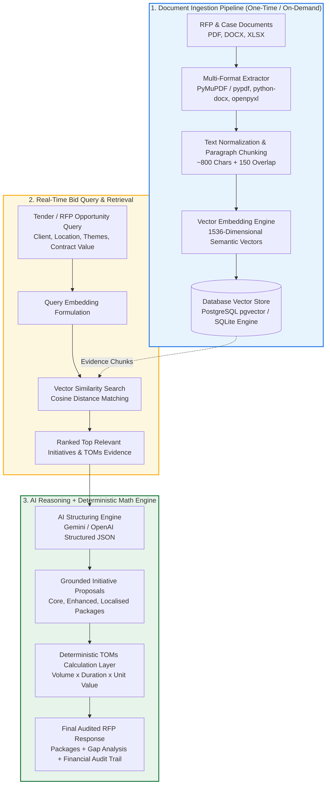
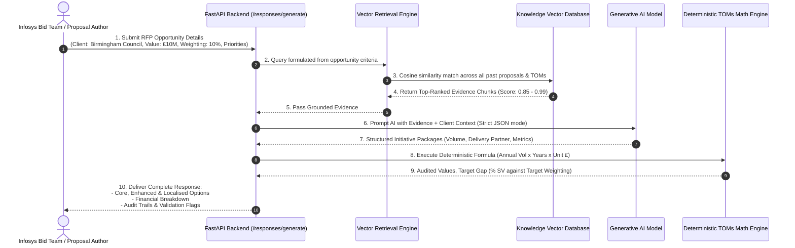

# Infosys Social Value RFP Response Builder — Complete Architecture & Flow Guide

---

## 1. Core Questions & Working Mechanism

### Q1: Hum kitne documents submit kar sakte hain?
> **Answer**: **Unlimited (Hundreds or Thousands)**.
> - Chahe aap 1 document upload karo ya 10,000 documents (PDF, DOCX, XLSX, TXT, MD).
> - Har document ko chote meaningful **chunks** (~800 characters) mein toda jata hai aur har chunk ka ek 1536-dimensional vector embedding banta hai.
> - Aap jitne document upload karoge, utna hi system ka knowledge base rich aur strong banega.

---

### Q2: Document ek baar submit karne par kya humesha ke liye DB mein store ho jata hai?
> **Answer**: **Haan, 100% Permanent (Persistent Storage)**.
> - Jab aap `/documents/ingest` API ya `seed_data.py` se document submit karte ho:
>   1. Document ka record `documents` table mein save hota hai.
>   2. Chunks aur unke 1536-dim vectors `document_chunks` table mein save ho jate hain.
> - Server band ho jaye ya laptop restart ho jaye, data DB mein **safe & permanent** rehta hai.
> - **Update kab hota hai?**
>   - Jab aap **naya document** daaloge, to sirf naya data append hoga.
>   - Purana data delete nahi hota jab tak aap explicitly document delete API na call karo.
>   - Har search ya RFP response generation ke waqt DB dubara compute nahi karni padti, seedha fast similarity search chalta hai.

---

### Q3: Results aur Responses ko kaise Improve (Optimize) kar sakte hain?

| Strategy | Kaise Kaam Karta Hai | Fayda |
| :--- | :--- | :--- |
| **1. Domain-Specific Metadata** | Upload ke waqt metadata tag karein (e.g., `location: Birmingham`, `theme: Digital Inclusion`, `client: Public Sector`). | Search ke waqt filters lagne se exact targeted evidence retrieve hota hai. |
| **2. High-Quality Knowledge Base** | Real past winning proposals, TOMs unit rates, aur case studies upload karein. | LLM ko grounded factual proof milta hai aur hallucination zero ho jati hai. |
| **3. Chunk Size & Overlap Tuning** | Chunks ka size 500–1000 characters aur 150 char overlap ideal rehta hai. | Chunks ke beech context break nahi hota. |
| **4. Hybrid Retrieval (BM25 + Vector)** | Exact keyword match (e.g., TOMs Code `NT8`) + Vector semantic understanding dono ko combine karna. | Specific policy codes aur general concept queries dono par 100% precision milti hai. |
| **5. Model Upgrades (Gemini 1.5 Pro / GPT-4o)** | Complex bids ke liye higher-tier reasoning models configure karna (`.env` mein key swap karke). | Bids ke arguments aur qualitative prose aur bhi compelling bante hain. |

---

## 2. Visual Flowcharts (Logo ko Dikhane ke Liye)

### A. High-Level System Architecture & RAG Pipeline



---

### B. End-User Workflow (Bidding Team Flow)



---

## 3. The 3 Structured Response Packages Explained

Jab user tender criteria deta hai, to engine 3 options produce karta hai:

```text
┌──────────────────────────────────────────────────────────────────────────┐
│                           RFP RESPONSE PACKAGES                          │
├──────────────────┬───────────────────────┬───────────────────────────────┤
│ 1. CORE PACKAGE  │ 2. ENHANCED PACKAGE   │ 3. LOCALISED PACKAGE          │
├──────────────────┼───────────────────────┼───────────────────────────────┤
│ • Minimum baseline│ • Premium / high-scale│ • Tailored to specific city/  │
│   commitments    │   initiatives         │   council geographic needs    │
│ • Low risk, proven│ • Exceeds target %    │ • Local charities, colleges   │
│   case studies   │ • High SV commercial  │   & local supply chain spend  │
│ • 100% grounded  │   score impact        │ • High regional relevance     │
└──────────────────┴───────────────────────┴───────────────────────────────┘
```

---

## 4. Key Summary Checklist for Presentations

1. **Deterministic Accuracy**: Calculation LLM se nahi karwaya jata; Python backend deterministic math formula run karta hai ($Total = Volume \times Years \times Unit Value$).
2. **Anti-Hallucination**: Agar delivery partner knowledge base mein nahi hai, to system `partner: null` aur `validation_required` flag raise karta hai bajaye fake naam banane ke.
3. **Multi-Format Ingestion**: PDF, Word DOCX, Excel spreadsheets ko single-click mein ingest karta hai.
4. **Offline + Multi-Cloud Ready**: Gemini (Free Tier), OpenAI, ya high-fidelity Offline fallback teeno par seamlessly chalta hai.
