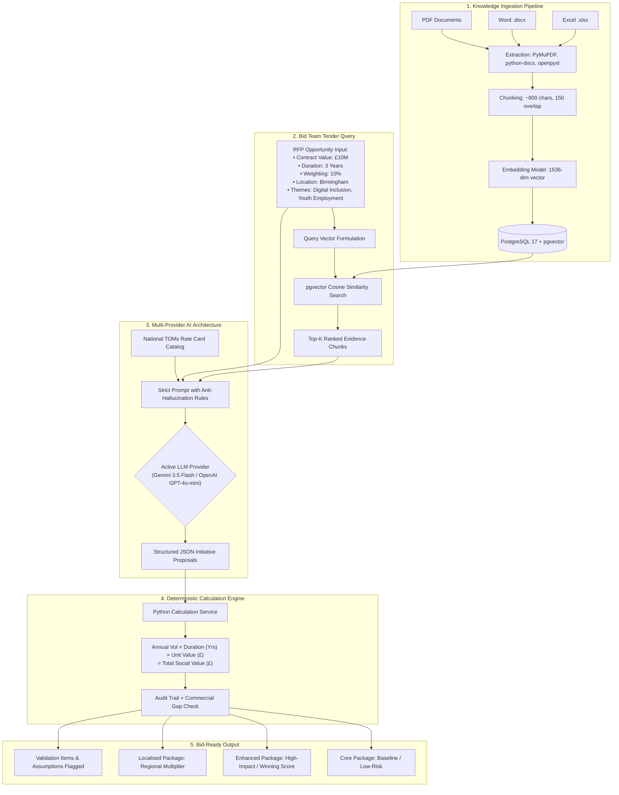

# Infosys Social Value RFP Response Builder
## Comprehensive Functional & Architecture Guide

---

## 1. Executive Summary: What Problem Does This Tool Solve?

In public sector procurement (UK Government, NHS, Local Councils like Birmingham City Council), tenders require a dedicated **Social Value commitment** (typically **10% to 20% of the total contract evaluation score**).

### The Challenge Today:
1. **Manual Effort & Repetition**: Bid teams spend weeks manually digging through old RFP responses, case studies, and CSR policies to find relevant initiatives.
2. **LLM Arithmetic Risk**: Traditional AI tools (like ChatGPT) "hallucinate" math and financial figures. Public sector bids require audited, legally binding commitments linked to frameworks like **National TOMs (Themes, Outcomes, and Measures)**.
3. **Localisation Deficit**: Tenders penalize generic corporate statements; councils demand ward-level, local evidence (e.g., Ladywood in Birmingham).

### Our Solution:
The **Infosys Social Value RFP Response Builder** combines:
- **Retrieval-Augmented Generation (RAG)**: Extracts verified initiatives from previous bids and approved policy documents.
- **Deterministic Calculation Engine**: Strict backend code calculates exact proxy values, percentage commitments, and commercial gaps.
- **Structured Multi-Package Generation**: Delivers 3 distinct options (Core, Enhanced, Localised) with explicit assumptions and validation requirements.

---

## 2. End-to-End Workflow Architecture



---

## 3. How the Tool Functions Step-by-Step

### Step 1: Knowledge Ingestion & Indexing
- The bid team uploads past tender responses, Infosys CSR documents, or partner agreements via `POST /documents/ingest`.
- Extractors parse:
  - **PDFs**: Page-by-page text with page index metadata.
  - **Word DOCX**: Structured paragraphs and data tables.
  - **Excel XLSX**: Multi-sheet tables and rate cards.
- Text is normalized and split into chunks of ~800 characters with 150 characters overlap.
- High-density 1536-dimensional vectors are generated and indexed in PostgreSQL using pgvector cosine distance (`<=>`).

### Step 2: Tender Opportunity Formulation
The user submits the opportunity parameters:
```json
{
  "contract_duration_years": 3,
  "contract_value_gbp": 10000000,
  "social_value_weighting_percent": 10,
  "client": "Birmingham City Council",
  "location": "Birmingham",
  "priorities": ["Digital Inclusion", "Youth Employment"]
}
```
The system formulates a semantic query:
`"Digital Inclusion, Youth Employment initiatives in Birmingham for Birmingham City Council"`

### Step 3: Vector Similarity Search
The query vector is compared against all chunks in pgvector. It extracts the top matching excerpts (e.g., Birmingham Digital Inclusion Clinics, St Basils youth mentoring programs, refurbished laptop donations).

### Step 4: Multi-Provider Structured Generation
The retrieved context, tender requirements, and official proxy metrics catalog are fed to the active LLM (**Google Gemini** or **OpenAI**):
- **Rule 1 (Anti-Hallucination)**: Flag `is_from_knowledge_base: true` only if supported by retrieved chunks.
- **Rule 2 (No Fake Partners)**: If no verified local partner is found, output `partner: null` and log to `validation_required`.
- **Rule 3 (No Arithmetic)**: LLM only estimates realistic delivery volumes (e.g., 4 workshops/year).

### Step 5: Pure Python Deterministic Calculations
The backend intercepts every proposed initiative and applies verified formulas:
$$\text{Initiative Social Value} = \text{Annual Volume} \times \text{Duration (Years)} \times \text{Unit Proxy Value (\pounds)}$$

**Example Calculation**:
- Initiative: Birmingham Digital Skills Clinics
- TOMs Code: `NT8` (Digital Inclusion Workshops)
- Unit Value: £1,250.00 / workshop
- Math: $4.0 \text{ workshops/yr} \times 3 \text{ yrs} = 12.0 \text{ workshops} @ \text{\pounds}1,250.00 = \text{\pounds}15,000.00$

### Step 6: Commercial Gap & Package Structuring
The engine calculates total Social Value commitment and evaluates whether the proposal meets the client's commercial weighting target:
$$\text{Client Target Weighting (10\% of \pounds 10,000,000)} = \text{\pounds}1,000,000.00$$
$$\text{Enhanced Package Total} = \text{\pounds}71,040.00 \quad (0.71\%) \quad \longrightarrow \quad \textbf{Commercial Gap Identified: GAP}$$

This instantly alerts the bid team that further initiatives or higher commitments are needed to win the tender.

---

## 4. The 3 Generated Packages Explained

| Package | Purpose & Strategy | Risk Profile | Example Initiatives |
|:---|:---|:---|:---|
| **Core Package** | Baseline compliance. Low risk, minimum viable commitment to satisfy mandatory tender criteria. | Low Risk | 4 Quarterly Digital Inclusion Workshops + 3 Youth Mentoring Pathways |
| **Enhanced Package** | Competitive advantage. High impact designed to maximize evaluation score and beat competitor bids. | Medium Risk | Staff STEM Outreach (100 hrs) + 20 Refurbished Laptops Donated + Tech Apprenticeships |
| **Localised Package** | Regional focus. Direct economic benefit channeled into the client's local authority wards. | High Local Impact | £50,000 Direct SME/VCSE Local Supply Chain Spend + Ward-level Digital Clinics |

---

## 5. What is Done vs. What is Left to Build

### What is Already Built & Working (Current State):
- Full FastAPI backend with OpenAPI / Swagger UI (`/docs`).
- Native PostgreSQL 17 + pgvector 0.8.6 indexing.
- PDF, DOCX, and XLSX extraction & chunking pipeline.
- Multi-Provider Adapter (Google Gemini 100% Free + OpenAI GPT-4o-mini + Resilient Offline).
- Deterministic National TOMs arithmetic calculation service with full audit trails.
- Anti-hallucination guardrails and automated `validation_required` flagging.
- Complete automated pytest test suite (9 tests passing).
- Terminal curl scripts and Postman Collection (`postman_collection.json`).

### What is Remaining for a Full Enterprise Product (Next Phases):

| Phase | Milestone | Description | Business Value |
|:---|:---|:---|:---|
| **Phase 2** | **Tender Export Service** | Download complete response directly as formatted **Word (.docx)** and **Excel (.xlsx)**. | Saves bid teams from copying JSON; gives them instant submission draft documents. |
| **Phase 3** | **Interactive Bid Tuner** | API endpoint to dynamically tweak initiative volumes to hit exact commercial targets (e.g., closing the gap to £1M). | Allows commercial teams to model different commitment levels in real time. |
| **Phase 4** | **Enterprise Document Ingestion** | Ingestion of real Infosys past bids, official National TOMs v29 rate cards, and case studies. | Grounding in authentic corporate credentials rather than synthetic test data. |
| **Phase 5** | **Interactive Frontend UI** | Modern Next.js / React web dashboard with visual charts, package comparison cards, and file uploaders. | Eliminates terminal/Swagger dependency; ready for client and executive demonstrations. |

---

## 6. How to Switch LLM Providers

In your `.env` file, toggle between providers with a single setting:

```env
# Switch between: 'auto', 'gemini', 'openai', or 'offline'
LLM_PROVIDER=gemini

# Google Gemini (Free Tier)
GEMINI_API_KEY=your_gemini_api_key_here
GEMINI_MODEL=gemini-3.5-flash
GEMINI_EMBEDDING_MODEL=gemini-embedding-001

# OpenAI (Paid)
OPENAI_API_KEY=sk-...
OPENAI_CHAT_MODEL=gpt-4o-mini
OPENAI_EMBEDDING_MODEL=text-embedding-3-small
```

No code modifications or database migrations are required when switching providers.
